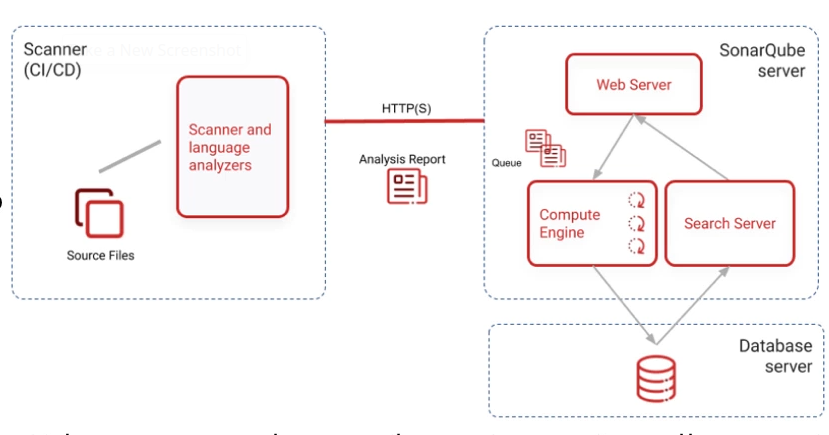

# devopslab

Studying docker, vagrant and other devops tools.

## Tools

### Ansible

With Ansible we can maintain an infrastructure with scalability
and maintenability. It's possible to version control the infrastructure to
better management and integration with the projects.

That's IaC - Infrastructure as Code!

#### Ansible concepts

There are two types of machines: Control node and managed hosts.
So it's possible to define who is the controler machine and who are the machines
it manages through a Host inventory file.

They communicate through SSH protocol, so it's easy to configure.

#### Ansible architecture

Divided in modules:

- Core modules: Adm activities for the OS.
- Custom modules: Customized components to modify and extend functionalities
using Python.
- Playbooks: YAML config archives for modules.
- Plugins: Extended functionalities implemented by others.
- Host inventory: Define the controlled hosts.
- Roles - Tasks for the system. They can be obtained on Ansible Galaxy and reused.

#### Control Node

Accessed by sysadmins to initiate operations.
Requires python and accepts most Linux and MacOS updated environments. Windows is not supported for production environments 

It's necessary to specify the hosts for the controlled machines at /etc/ansible/hosts. You can specify groups like this:

```txt
[apps]
app_host_name_or_ip

[databases]
db_host_name_or_ip
```

To use host names, if you don't have a DNS server, you can create host names at /etc/hosts appending ip and host name to the file like this:

`192.168.1.3 app_host_name`

#### Play books

Use YAMLS that can be reutilised from the roles folder and used from Ansible Galaxy. Looks like a pipeline for Github or Gitlab. You define plays that are a set of tasks, each task uses a set of modules to access system binaries, applications, libs and such. 

##### Playbook example

```yaml
---
- name: Configures app    # Gives a title to the playbook
  hosts: app01            # Which hosts it controls. Use the host name in ansible hosts file

  user: vagrant           # Configuring default user, this is the default user for a vagrant machine
  become: true            # Use privilege to execute actions (like sudo)

  vars:                   # Variables that can be used inside template files and variables
    dbhost: "db01" 
    dbname: "notes"

  tasks:                  # Defines a set of plays using a set of modules
    - name: Config hosts  # A task always starts with a name
      lineinfile:         # Module to insert lines in files
        dest: /etc/hosts
        state: present
        line: "{{item}}"  # Ansible uses variables with "{{}}" syntax. It must be in a quoted String
      with_items:         # Items that will be placed 
        - 192.168.1.2 app
        - abcd 123 5678
    - name: Add user
      user:               # Module to add and manage users
        name: username
        comment: Anything 
        uid: 500
    - name: Install git
      yum:                # Module to use yum on centos systems
        name: git
        state: latest
    - name: Install Java 8
      yum:
        name: java-1.8.0-openjdk
        state: latest
    - name: Creating files and dirs
      file:               # Module for files and dirs
        path: /opt/any
        state: directory  # Specify file type
        owner: username
        group: username
    - name: Clone with git
      git:                # Module to config and use git
        repo: 'repolink.git'
        dest: /opt/any
        clone: true
        force: true
    - name: Use a template file
      template:           # Uses a template file located at templates directory on ansible project file structure
        src: app.properties
        dest: /opt/any/app.properties
    - name: Running tasks with specific user
      command: echo "Vou fazer um skate q ela não vai skatêÊÊ" | grep -E 'skate' # Module to execute binaries and commands
      become_user: username     # Executes task with ans specific user
      register: skate_legal     # This modules registers task output that can be accessed with variables and templates. The stdout output of a shell command could be accessed like this: {{skate_legal.stdout}}
      notify: any_handler       # This module can call for handlers names as a trigger after a task is done
    - name: Start docker
      service:                  # Module to handle linux services
        name: docker
        state: restarted

  roles:
    - some-custom-role-inside-roles-folder
    - some-installed-role-from-ansible-galaxy

  handlers:                   # Can be defined here or at handlers directory
    - name: any_handler
      systemd:                # Module that manages linux systemd
        daemon_reexec: true   # Restarts systemd servers
```

### Docker Swarm

Builtin lightweight way of managing multiple docker hosts that can be on different machines

#### Architecture

- Nodes: docker engine instances that are on a cluster swarm
- Manager Node: The cluster orchestrator. There can be only one... for each cluster.
- Worker Node: Executes the manager tasks. The manager is the default worker.
- Service: Set of defined tasks for the manager or from the manager to the other workers.
- Task: Container process.
- Load Balancer: Exposed ports and services.

#### Creating Docker Swarm

At the manager: `docker swarm init --advertise-addr <INSERT_MANAGER_IP>` . This is going to generate a token. 

At the workers: `docker swarm join --toker <GENERATED_TOKEN> <MANAGER_IP>:2377`

`docker node ls` to list the nodes in the cluster

Creating a service: `docker service create --name demo --publish <GUEST>:<HOST> <DOCKER_IMAGE>`

`docker service ls` to list the created services

To scale for other nodes in the cluster: `docker service scale demo=3`

### Sonaqube

Code quality check. Static and Dynamic.

#### Architecture


